# DockIt

> Drug Discovery, On the Go. Powered by AutoDock Vina.

**DockIt** is a molecular docking platform that brings [AutoDock Vina](https://vina.scripps.edu/) to your browser and phone. Search proteins and ligands from public databases, submit docking jobs, and visualize results — no installation required.

### [Launch Web App](https://lcbc-client.apps.johnseong.com) &nbsp;|&nbsp; [Documentation](https://wonmor.github.io/LCBC-Dock/) &nbsp;|&nbsp; [Privacy Policy](https://wonmor.github.io/LCBC-Dock/privacy.html)

Available on **Web**, **iOS**, and **Android**.

Developed by **John Wonmo Seong** at [Seoul National University](https://en.snu.ac.kr). Special thanks to Professor Juyong Lee at the Computational Drug Discovery Lab.

---

## Screenshots

### Mobile (iPhone)

<p align="center">
  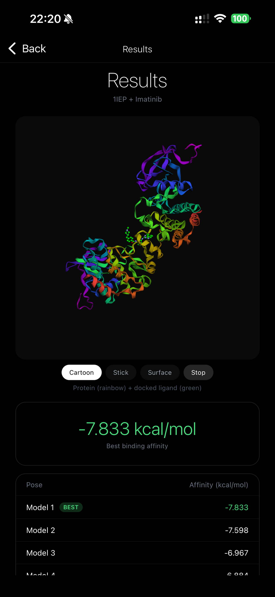
  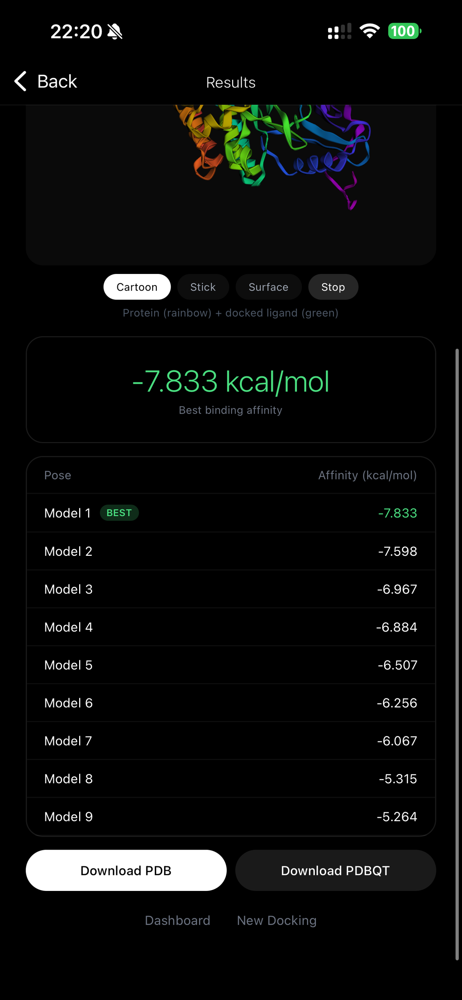
  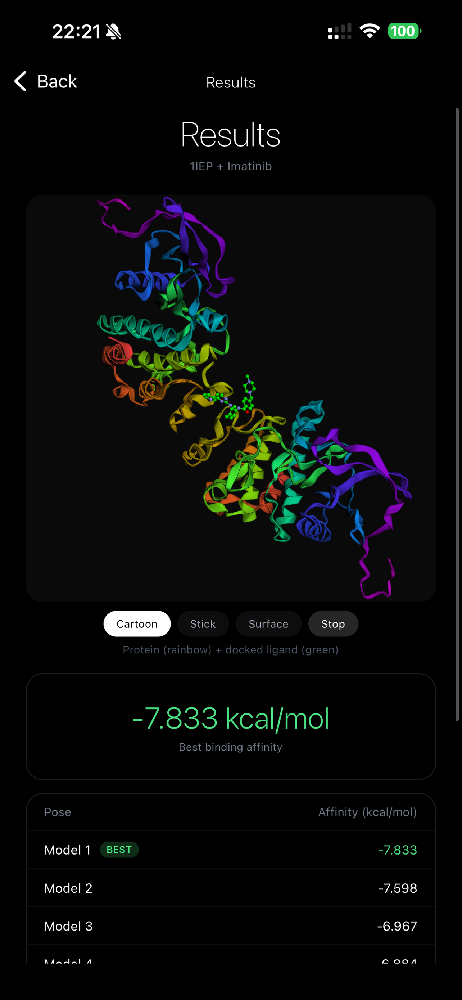
  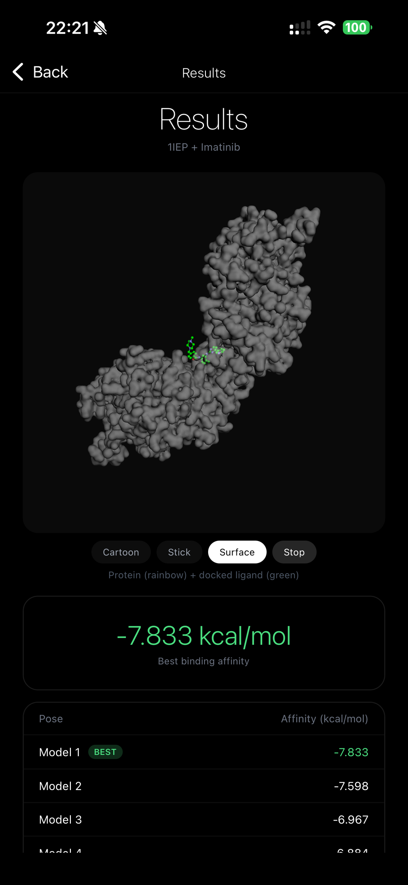
  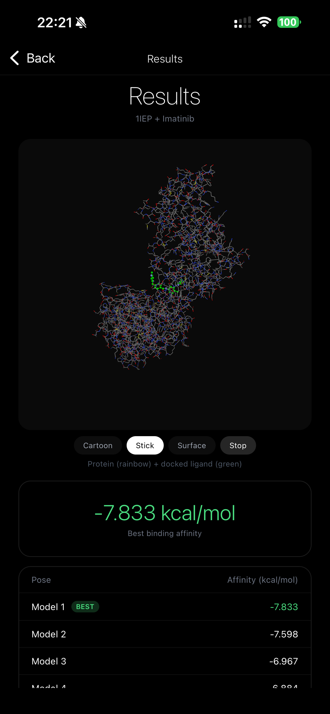
  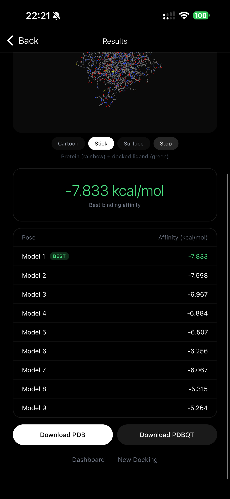
</p>

### Tablet (iPad)

<p align="center">
  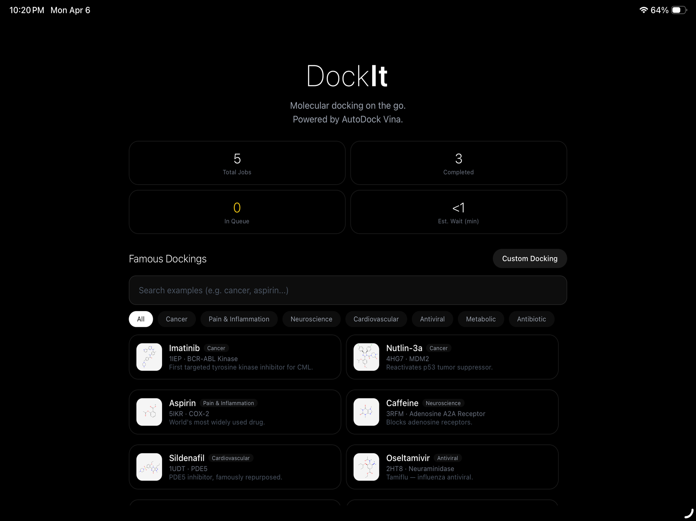
  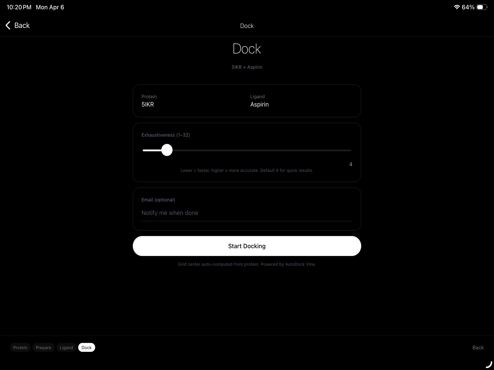
  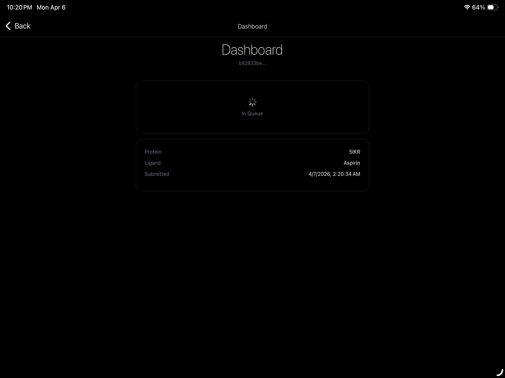
</p>
<p align="center">
  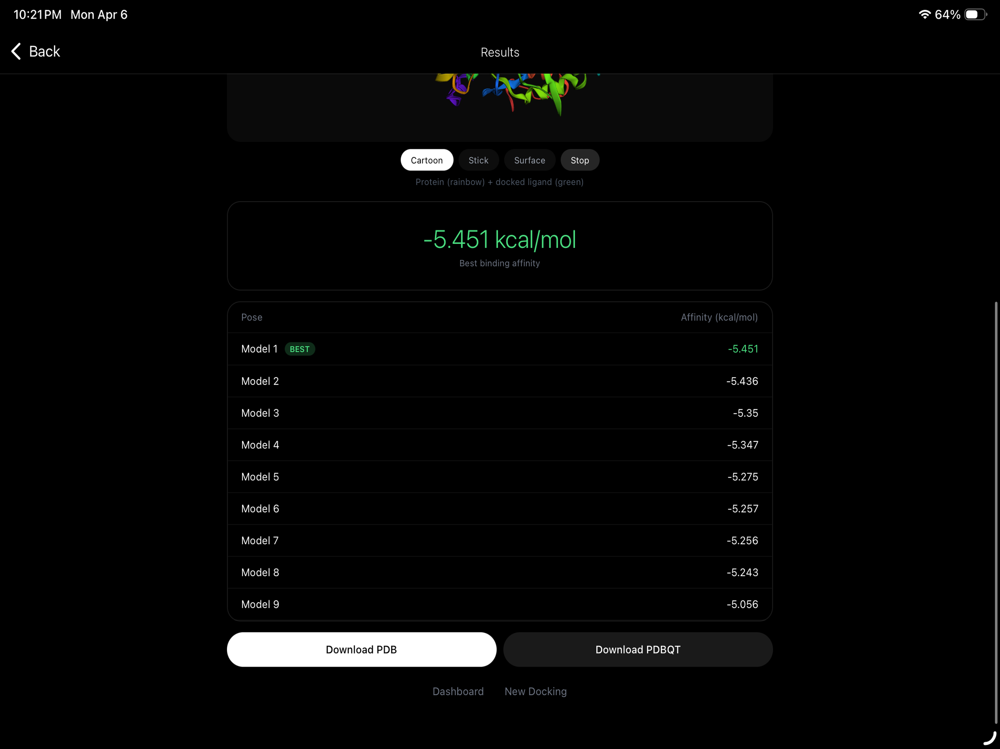
  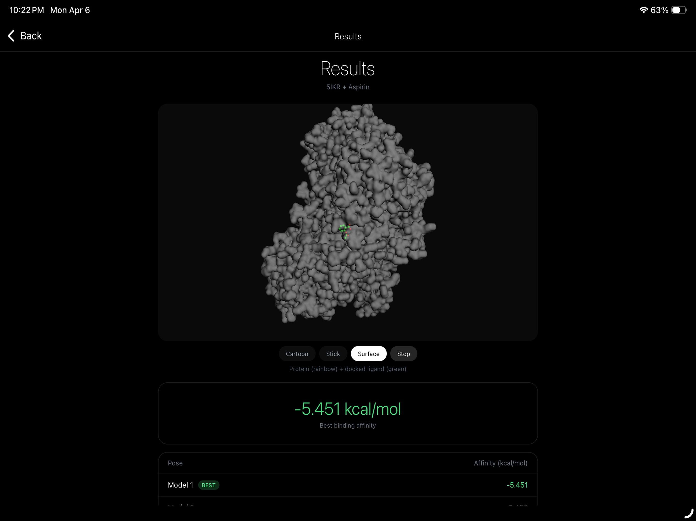
  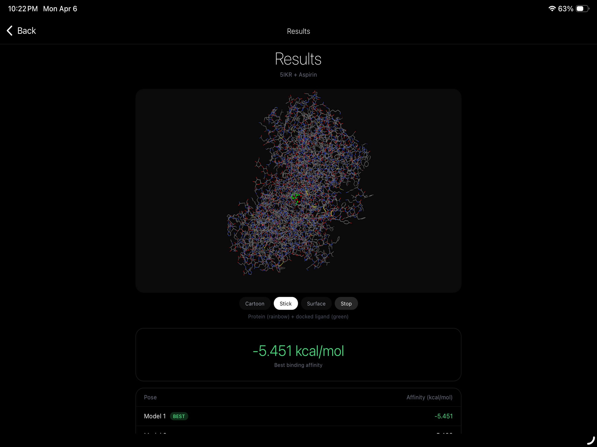
</p>

---

## Features

- **Protein Search** — 200,000+ structures from [RCSB PDB](https://www.rcsb.org/)
- **Ligand Search** — 100M+ compounds from [PubChem](https://pubchem.ncbi.nlm.nih.gov/) with 2D structures, formula, weight, and SMILES
- **Protein Preparation** — Removes water and heteroatoms, protonation at pH 7.4
- **AutoDock Vina** — Configurable exhaustiveness, auto-computed grid center
- **Live Progress** — Step-by-step status updates with ETA countdown and full log history
- **3D Viewer** — Interactive 3Dmol.js viewer with cartoon/stick/surface modes and docked ligand overlay
- **Examples Gallery** — 16 famous dockings (Imatinib, Aspirin, Caffeine, Remdesivir, etc.) with search and category filters
- **Email Notifications** — Get notified when jobs complete or fail
- **Download Results** — Export docked poses in PDB or PDBQT format
- **Mobile App** — Native iOS & Android app with tablet-optimized layouts
- **Live Stats** — Queue length, completed jobs, and estimated wait time on the homepage

---

## Examples Gallery

16 curated famous protein-ligand dockings across 7 categories. Tap any example to start docking instantly.

| Ligand | Protein | Category |
|--------|---------|----------|
| Imatinib | BCR-ABL Kinase (1IEP) | Cancer |
| Nutlin-3a | MDM2 (4HG7) | Cancer |
| Aspirin | COX-2 (5IKR) | Pain & Inflammation |
| Caffeine | Adenosine A2A (3RFM) | Neuroscience |
| Sildenafil | PDE5 (1UDT) | Cardiovascular |
| Oseltamivir | Neuraminidase (2HT8) | Antiviral |
| Remdesivir | RdRp (7BV2) | Antiviral |
| Lopinavir | HIV-1 Protease (1MUI) | Antiviral |
| Paclitaxel | Tubulin (1JFF) | Cancer |
| Metformin | AMPK (4CFF) | Metabolic |
| Tamoxifen | Estrogen Receptor α (3ERT) | Cancer |
| Donepezil | Acetylcholinesterase (2RG6) | Neuroscience |
| Erlotinib | EGFR Kinase (3NYA) | Cancer |
| Atorvastatin | HMG-CoA Reductase (3OGP) | Cardiovascular |
| Methotrexate | DHFR (2ITO) | Cancer |
| Penicillin G | PBP (1PWC) | Antibiotic |

---

## Docking Workflow

| Step | Page | Description |
|------|------|-------------|
| 1 | `/docking/protein` | Search and select a protein from RCSB PDB |
| 2 | `/docking/marinate` | Prepare protein (remove water, heteroatoms, add charges) |
| 3 | `/docking/ligand` | Search and select a ligand from PubChem |
| 4 | `/docking/cook` | Configure exhaustiveness, add email, and submit |
| — | `/dashboard` | Track job status with live progress and ETA |
| — | `/examples` | Browse 16 curated famous dockings |
| — | `/results/[jobId]` | 3D viewer with docked ligand, binding affinities, downloads |

---

## Architecture

```
┌──────────────────────────────────────┐
│     Frontend (Next.js on CapRover)    │
│         lcbc-client app               │
│                                       │
│  /api/rcsb    → RCSB PDB search       │
│  /api/pubchem → PubChem search        │
│  (server-side proxies, no CORS)       │
│                                       │
│  /docking/*   → protein/ligand flow   │
│  /examples    → curated docking gallery│
│  /dashboard   → job tracking           │
│  /results/*   → 3D viewer + download  │
└──────────────┬───────────────────────┘
               │
               │ POST /api/dock
               │ GET  /api/jobs/{id}
               │ GET  /api/results/{id}
               ▼
┌──────────────────────────────────────┐
│     Backend (FastAPI on CapRover)     │
│         lcbc-server app               │
│                                       │
│  ┌────────────────────────────────┐   │
│  │   Docking Worker Thread         │   │
│  │   AutoDock Vina + Open Babel    │   │
│  └────────────────────────────────┘   │
│                                       │
│  SQLite (/app/data/lcbc_dock.db)      │
│  SMTP email notifications              │
└──────────────────────────────────────┘

┌──────────────────────────────────────┐
│     Mobile App (Expo React Native)    │
│         iOS & Android                 │
│                                       │
│  Same 4-step docking workflow          │
│  Examples gallery with search          │
│  3Dmol.js viewer via WebView          │
│  Direct API calls (no CORS proxy)     │
│  Tablet-optimized responsive layout   │
└──────────────────────────────────────┘
```

---

## Project Structure

```
LCBC-Dock/
├── app/                          # Next.js frontend (App Router)
│   ├── api/
│   │   ├── pubchem/route.ts      # Server-side PubChem proxy
│   │   └── rcsb/route.ts         # Server-side RCSB PDB proxy
│   ├── components/
│   │   └── ProteinViewer.tsx     # 3Dmol.js interactive viewer
│   ├── docking/
│   │   ├── protein/page.tsx      # Step 1: Protein search + 3D viewer
│   │   ├── marinate/page.tsx     # Step 2: Protein preparation
│   │   ├── ligand/page.tsx       # Step 3: Ligand search
│   │   └── cook/page.tsx         # Step 4: Docking config + submit
│   ├── examples/page.tsx         # Curated examples gallery
│   ├── dashboard/page.tsx        # Job tracking with live progress
│   ├── results/[jobId]/page.tsx  # Results + 3D docked pose viewer
│   ├── about/page.tsx
│   ├── layout.tsx
│   ├── page.tsx                  # Homepage with inline examples + stats
│   └── globals.css
├── mobile/                       # Expo React Native app (iOS & Android)
│   ├── app/                      # Expo Router screens
│   ├── components/               # ProteinViewer, StepIndicator, Spinner
│   ├── lib/                      # API helpers, useLayout hook
│   ├── plugins/                  # Kotlin version config plugin
│   ├── assets/                   # App icons & splash screen
│   └── app.json                  # Expo config (iOS + Android)
├── api/                          # FastAPI backend
│   ├── index.py                  # API endpoints + stats
│   ├── docking.py                # Vina docking engine
│   ├── worker.py                 # Background job processor with progress
│   ├── database.py               # SQLite + status message logging
│   ├── email_service.py          # SMTP notifications
│   └── models.py                 # Pydantic models
├── screenshots/                  # App Store screenshots
│   ├── *.PNG                     # iPhone (1284x2778)
│   └── ipad/*.PNG                # iPad (2732x2048)
├── docs/                         # GitHub Pages
│   ├── index.html                # Documentation site
│   └── privacy.html              # Privacy policy
├── Dockerfile.frontend
├── Dockerfile.backend
├── deploy.sh                     # CapRover deploy script
├── package.json
├── requirements.txt
└── README.md
```

---

## Deployment

### CapRover (Web)

```bash
# Login (one-time)
caprover login

# Deploy everything
bash deploy.sh all

# Deploy frontend or backend only
bash deploy.sh frontend
bash deploy.sh backend
```

| App | Dockerfile | Port |
|-----|-----------|------|
| `lcbc-client` | `Dockerfile.frontend` | 3000 |
| `lcbc-server` | `Dockerfile.backend` | 8000 |

### Backend Environment Variables

In CapRover dashboard → `lcbc-server` → **Bulk Edit**:

```
SMTP_USER=yourname@gmail.com
SMTP_PASS=your_16_char_app_password
FROM_EMAIL=yourname@gmail.com
BASE_URL=https://lcbc-client.apps.johnseong.com
```

Persistent storage: `/app/data` → `lcbc-data`

### Mobile (App Store / Play Store)

```bash
cd mobile
npm install
eas build --platform all
eas submit --platform ios
eas submit --platform android
```

| Field | iOS | Android |
|-------|-----|---------|
| Bundle ID | `com.johnseong.dock-it` | `com.johnseong.dock_it` |
| Backend | `https://lcbc-server.apps.johnseong.com` | same |

---

## Local Development

```bash
git clone https://github.com/wonmor/LCBC-Dock.git
cd LCBC-Dock

npm install                       # Frontend
pip3 install -r requirements.txt  # Backend
cp .env.example .env

npm run dev                       # Starts both on :3000 and :8000
```

### Mobile

```bash
cd mobile
npm install
npx expo start
```

---

## Tech Stack

| Layer | Technology |
|-------|-----------|
| Web Frontend | Next.js 13, React 18, TypeScript, Tailwind CSS, 3Dmol.js |
| Mobile App | Expo SDK 52, React Native, Expo Router, WebView |
| Backend | FastAPI, Python 3.11, AutoDock Vina 1.2.5, Open Babel |
| Database | SQLite |
| Data Sources | RCSB Protein Data Bank, PubChem |
| Deployment | CapRover (web), EAS Build (mobile) |
| Email | SMTP (Gmail compatible) |

---

## API Endpoints

| Method | Endpoint | Description |
|--------|----------|-------------|
| `GET` | `/` | Health check |
| `GET` | `/api/stats` | Queue stats (total, completed, wait time) |
| `GET` | `/api/proteins/search?q=` | Search RCSB PDB |
| `GET` | `/api/proteins/{pdb_id}` | Protein details |
| `GET` | `/api/proteins/{pdb_id}/center` | Compute grid center |
| `GET` | `/api/ligands/search?q=` | Search PubChem |
| `GET` | `/api/ligands/{cid}` | Ligand details |
| `POST` | `/api/dock` | Submit docking job |
| `GET` | `/api/jobs/{job_id}` | Job status + progress message |
| `GET` | `/api/results/{job_id}` | Docking results with poses |
| `GET` | `/api/results/{job_id}/download/pdb` | Download PDB |
| `GET` | `/api/results/{job_id}/download/pdbqt` | Download PDBQT |

---

## Contact

For research inquiries, funding, and collaboration: **[john@orchestrsim.com](mailto:john@orchestrsim.com)**

## License

[MIT](LICENSE)

---

> Built by John Wonmo Seong at Seoul National University.
> Special thanks to Professor Juyong Lee at the Computational Drug Discovery Lab.
